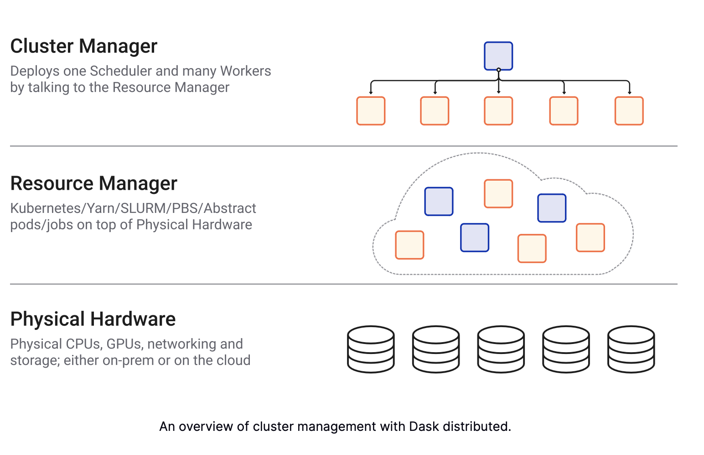
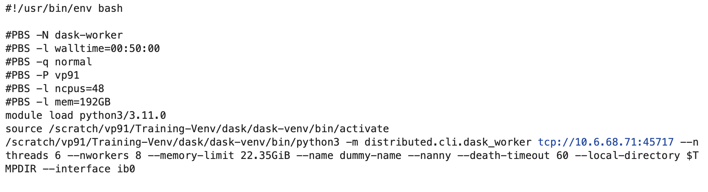
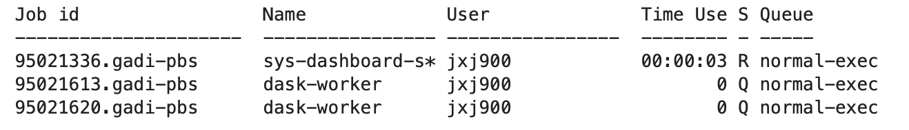
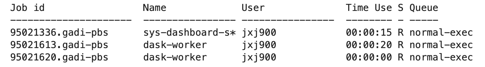
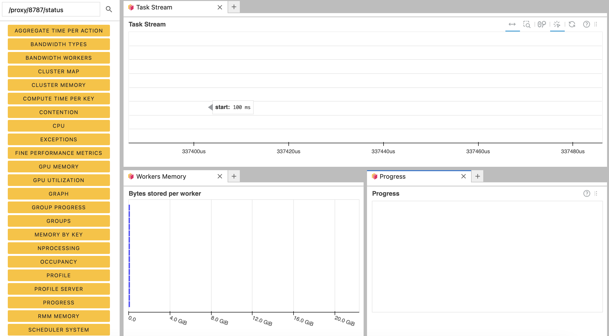

# Distributed Dask on Gadi
This repository offers detailed guidance for setting up a distributed Dask Cluster on the Gadi supercomputer, leveraging the PBS job scheduler.



Dask.distributed serves as a centralized, distributed, and adaptable task scheduler. The heart of the Dask system, its central scheduler, orchestrates the activities of numerous Dask worker processes deployed across various machines, all while efficiently handling concurrent requests from multiple clients.

To interact with the PBS job scheduler on Gadi, you'll require the following Python library.

```

from dask_jobqueue import PBSCluster

```

In this tutorial, we'll utilize a Python virtual environment. The virtual environment can be found at __/scratch/vp91/Training-Venv/dask/dask-venv__. The prerequisites for building this virtual environment are available in the text file __requirements.txt__.

We can can use the following command to deploy a Dask cluster using Dask.

```
cluster = PBSCluster(walltime="00:50:00", 
                     cores=48, 
                     memory="192GB",
                     shebang='#!/usr/bin/env bash',
                     job_extra_directives=extra, 
                     local_directory='$TMPDIR', 
                     job_directives_skip=["select"], 
                     interface="ib0",
                     job_script_prologue=setup_commands,
                     python=os.environ["DASK_PYTHON"])

```

Where 
1. **walltime**: Maximum walltime for each worker job.
2. **cores**: Total number of cores per job.
3. **shebang**: Path to desired interpreter for your batch submission script.
4. **job_extra_directives**: List of other PBS options. Each option will be prepended with the #PBS prefix.
5. **local_directory**: Dask worker local directory for file spilling.
6. **job_directives_skip**: Directives to skip in the generated job script header. Directives lines containing the specified strings will be removed. Directives added by job_extra_directives won’t be affected.
7. **interface**: Network interface like ‘eth0’ or ‘ib0’. This will be used both for the Dask scheduler and the Dask workers interface
8. **job_script_prologue**: Commands to add to script before launching worker
9. **python**: Python executable used to launch Dask workers. Defaults to the Python that is submitting these jobs

Gadi employs a customized PBS setup, which means that some default values in the function might not be compatible with Gadi's configuration. For example, the default PBS expects __#PBS -A <project name>__ to indicate the project in use, while Gadi's PBS uses __#PBS -P <project name>__. You can find these additional directives in the __job_extra_directives__ section. Likewise, there could be certain default directives that we need to omit, which is covered under __job_directives_skip__.

Many HPC clusters are equipped with low-latency networks such as InfiniBand. To configure Dask to utilize a particular network interface, we can make use of the __interface__ parameter. Additionally, we must load necessary modules and activate our virtual environment on each node within the cluster. These directives and setup steps are detailed in the __job_script_prologue__.

We can verify the job script generated to request the nodes using

```

cluster.job_script()

```


These parameters define the attributes of an individual job or a single compute node, rather than describing the attributes of your entire computation. At this point, no jobs have been initiated. To execute the complete computation, you will subsequently request a specific number of jobs using the __scale__ command:

```

cluster.scale(jobs=2)

```

You can check the status of the workers using the PBS command __qstat__. Initally, the request for workers may be queued, but not allocated



But the PBS job scheduler will eventually allocate the workers that were requested. 




Within Dask-Distributed, a Worker represents a Python object and a node within a Dask Cluster, serving a dual role: 1) providing data and 2) executing computations. On the other hand, jobs are resources that are submitted to and managed by the job queuing system like PBS. In the context of Dask-Jobqueue, a single Job can encompass one or more Workers.

Dask also offers a dashboard that could be used for monitoring the workers and other activities within the Dask environment.




